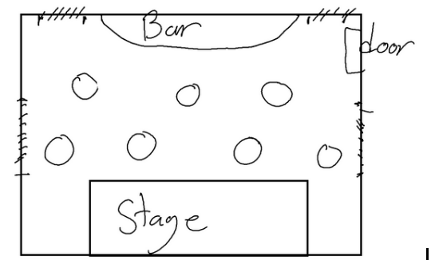
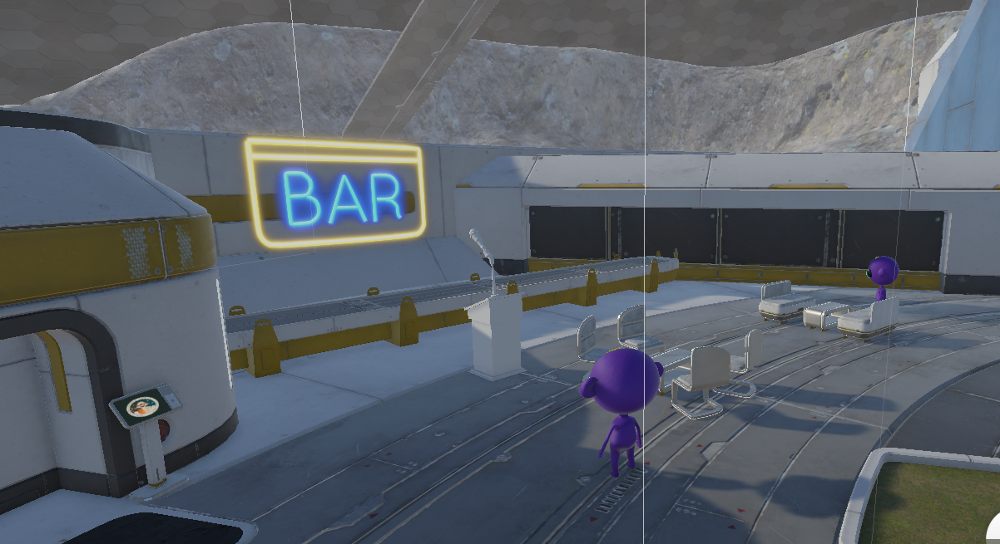
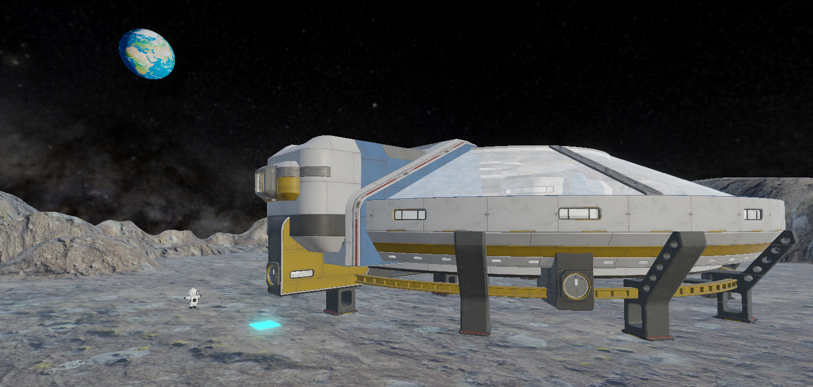
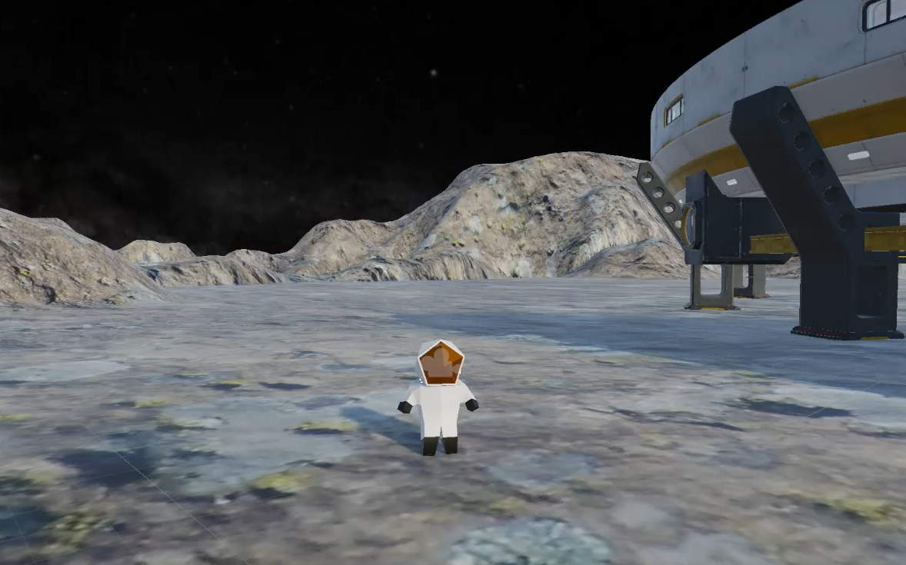
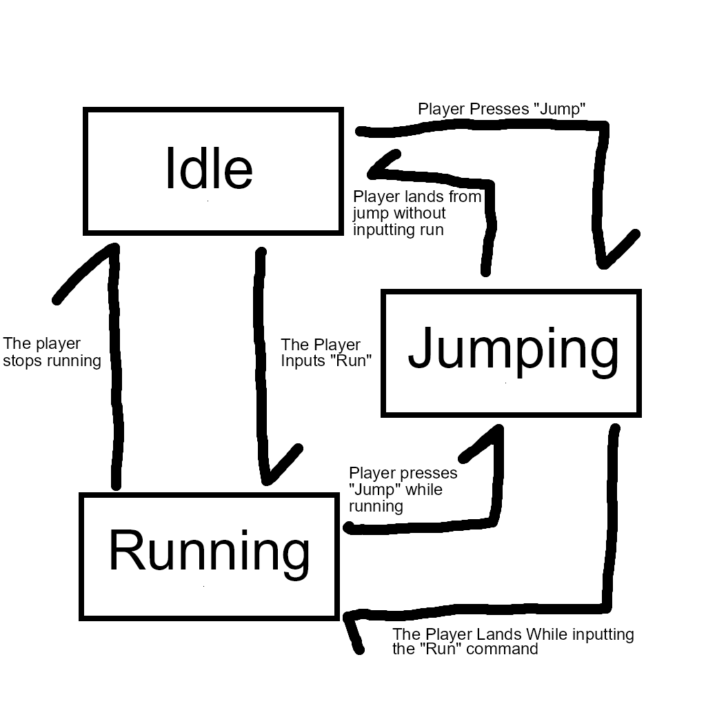
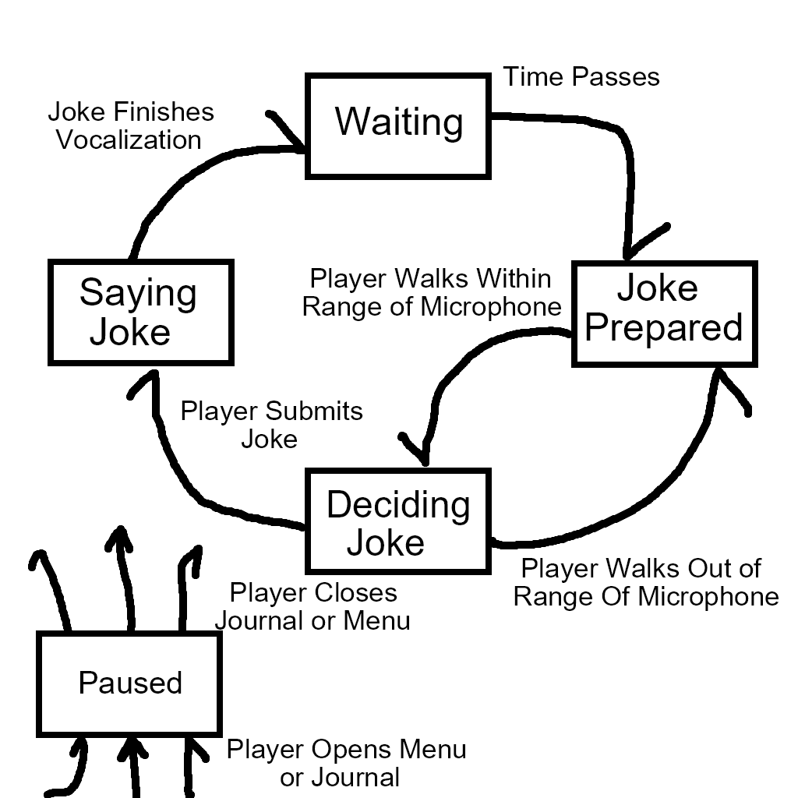
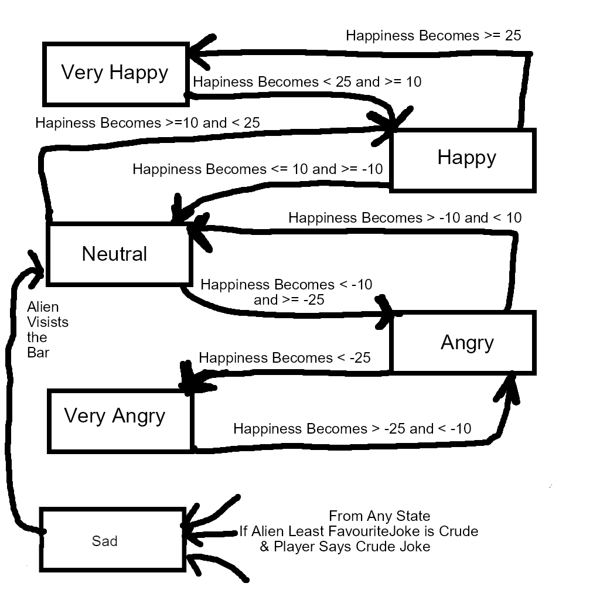

# CISC486GD-extraterrestrial-entertainment Group 5 Proposal
## Game Title:
Seeing as our game will be about uniting various alien races through comedy, our title is “Extraterrestrial Entertainment!”
## Core Gameplay:
The game follows a human stand-up comedian at an intergalactic comedy bar/theatre that is trying to appease various alien races that frequent it. Every alien race (of which there will be 3-4) have different cultural upbringings and therefore find different kinds of jokes funny. The player will have to choose between different alien words to make jokes and see how many “audience points” they can get. These foreign alien words will make the joke fit into a certain genre (e.g. self-deprecating, crude, wholesome, silly, etc). Some aliens may dislike certain genres of jokes but as long as a majority of the crowd is smiling and enjoying themselves, the player can win them over. A large drive to this game, and to enforce the puzzle like nature, is that the aliens language is foreign to the player. The player will have a notebook that they can keep track of what alien's words elicit what reaction, and guesses on what each word could mean. The player will have to input different words to try and make jokes that fall into a category that the aliens will like. This language will follow common rules that the player will get to discover over time.   

Information regarding the multiplayer section of gameplay can be found within the player setup section
## Game Type:
Our game doesn’t perfectly fit into existing genres, but the closest thing we can compare it to would be a point-and-click puzzle game of sorts. We give clues as to what kind of jokes certain alien races may enjoy and it is up to the player to figure out the majority of the audience's preferences and make the appropriate joke, almost like a gameshow or a puzzle. This game will also have elements of other genres, the real time dodging of tomatoes when the player is not doing well has elements of action games. 
## Player Setup:
The main game will focus on one player winning over a crowd of alien NPCs, but there will also be an online multiplayer versus mode where 2 players will have a “comedy battle”. This could be freestyling (quicktime events) where each player will have a list of options and they need to choose the option they think is best in a limited time (faster could gain more points). It could also follow the “Mad-Libs” style of show the single player will have where both players are given the same prompt for a joker format, and at each blank spot, both players will receive a few options. Players will score more points for the best answer, as well as the speed at which they answer. 
## AI Enemies and NPCs:
The NPCs will be aliens that are part of an audience to a comedy show. These aliens will react to the jokes made by the player and change their emotions based on whether they like the joke or not. Currently, we are thinking of adding neutral, happy, angry and sad emotional states for the aliens. Another idea we had is that if the player continuously makes jokes that an alien race doesn’t like, they will throw items like tomatoes that the player will have to dodge. Getting hit could reduce the player’s score and lower the audience’s enjoyment.The NPCs are also not tied to their seats during the performance, they will have the ability to randomly travel to get drinks from the bar, which will change which aliens are listening or not, changing scoring. Additionally, with enough bad performances, the NPCs can get so angry that they leave the bar for the round.  

Some Examples Of FSMs that will be in use 
# Alien Movement FSM: 
SearchingForSeat - Starting State, The alien will start to search for an open seat that it could sit in.    
FoundSeat - After a seat is found, the alien will walk towards it to sit down.   
SittingAndListening - The longest state the alien will be in, the alien is seated into a chair, and listening to the jokes the player says, the scoring and aliens, In this state, the Alien Emotion FSM is activated.   
RespondingToJoke - After a joke is said, the alien has the opportunity to react to the joke to signal their emotion.   
HeadingToBar - If the alien is SittingAndListening, they have the chance to enter HeadingToBar to start walking towards the bar and disable the Alien Emotion FSM and be taken out of the scoring algorithm.   
LeavingBar - If the alien is in the Very Angry or Angry State in the Alien Emotion FSM, they are able to enter LeavingBar state and leave the bar.   
# Alien Emotion FSM:
Neutral - The starting state of each of the aliens. Represents the neutral   
Happy - If the player says some good jokes for this alien, they will enter this state and give the player increased points.   
Very Happy - If the player says a lot of perfect jokes for this alien, they will enter this state, and give the player Maximum points.   
Angry - The player can enter this state from Sad or Neutral. In this state, the alien will be more likely to head to the bar for a drink, and has a chance to throw a tomato, or enter the LeavingBar state   
Very Angry - The Alien can enter this state from Angry, In this state, the alien is very likely to leave its seat, and has a very high chance to throw tomatoes.   
Sad -  The alien can enter this state when the player says a wrong joke, and that joke is either self deprecating or some other emotion that isn't the aliens preferred joke. The alien is very likely to go to the bar in this state and has a small chance of leaving.   

# Additional FSMs to be made for: 
Status of player: When to prompt for new jokes, how to tell if currently telling a joke, ETC.   
Status of thrown objects: About to be thrown, thrown, hits, misses, ETC.   
Potential Bartenders to serve customers.   
## Scripted Events:
Our aliens will have many different scripted events that will occur. First, at the very beginning of the game, the aliens will enter, and randomly make their way to seats to listen to the jokes. Also, randomly, the aliens can get up to go to the bar, which will dynamically change the amount of scoring the jokes will generate. If the player is scoring poorly, and the jokes are not enjoyed by the audience, the aliens have the ability to stand up and leave the building. If the player is scoring well, more aliens will hear about their performance and travel to come see the show. 
## Environment:
The main setting for the environment is a “Galactic Comedy Bar” a place where aliens of all types can hang out and have a laugh. These “Galactic Comedy Bars” will have a main stage area where the playable characters will play through the main gameplay loop. In front of the stage, there will be multiple tables with chairs where the aliens will sit and watch the show. There is also a bar that the aliens can get drinks from. Lastly, there is a door where the aliens can enter (when the game starts) and leave (when the aliens dislike the show). 

### Possible ideas if we have enough time to implement them:
Each Comedy bar could have something unique about it that can influence gameplay.   
A larger enhancement that is more advanced is that player is opening their own comedy bar and they can upgrade the bar to increase their performance. For example, upgrading the bar area would increase sales for drinks and thus make the audience laugh more easily. More tables could be purchased to increase the size of the audience. Improvements to the furniture or decorations can enhance the customer experience and improve their moods. A music player can make the bar feel more lively and improve the audience’s mood.
Increased staff reduces wait time. Players will make money based on their performance during the show and then can reinvest it into their comedy bar.
## Planning Factors: 
Planning To Be Made in Unity 6.2 (Version 6000.2.4f1) 
### Asset Preparation: 
Many 3D assets will be gathered from the unity store, as well as other distribution platforms like itch.io and kitbash3d.com. For music and sounds, we will use a combination of royalty free music (freemusicarchive.org) and sound effects as well as creating our own sound effects when needed. 
### Storage Structures: 
The alien languages and their meanings will be stored in a large lookup table/hash table for quick indexing. 
### Coding Practices:
Each of the main components and functionalities will have separate folders. With subfolders representing their corresponding sub tasks, This is to help separate conflicts with GitHub and to keep the code modular. 
### Group Name: MouseaNdKeyboard
### Group Roles:
**Kabeer** - I can handle asset management, working on levels, pathfinding for NPCs and handling the emotional state switching. Also probably writing some of the basic lore that will help the player.  
**Nicholas** - I can write all of the alien language and the “emotions” that go with each of the words. I can also help with the coding of the players actions, jokes and the scoring functionality. I can also help with finding and making 3d models for the environment.   
**Marcus** - I can work on designing the environment, designing 3d models, and coding scripts for events like throwing objects. I can also find and implement the audio, such as the laughter for the audience, background music, and other sound effects  
### Universal Commitments - 
Maintaining meaningful GitHub commit messages. Writing of upcoming assignments. Robust coding comments. Debug options for all implementations to visualize assignment requirements for all assignment deliverables. Brainstorming  
Made By:    
**Marcus Secord**: 20ms130 - 20268223  
**Nicholas Tillo**: 20njt4 - 20291255   
**Kabeer Adil**: 20ma101 - 20283057  

# Assignment 2 Deliverables:

## Enviroment
The Space Bar enviroment has been made, with multiple sections an interior and an exterior that the player can explore. The main attraction is the microphone stand where the player is able to start their comedy routine. It also has a fully rendered rotating sun and earth sky that helps to illuminate the area and immerse the player. 

## Player 
The player themselves has been fully equipped for their space travels & joke telling. They are fully modelled as a astronaut with full gear. Their movement is fully implemented, with a unique gravity when they are inside or outside the space bar.   

# Finite State Machines

### Player Movement FSM
This is the simplist of the FSM's, it represents the state that the player is currently in. This FSM dictates the Animator component that the player has attached to them to tell it which animation to play. The player can move between 3 states:  
Idle - Not moving at all, the player starts in this state, they can then enter either of the 2 other states.   
Runnning - When the player is moving along the ground they are considered running. This state can be entered from any of the other states, and can transition to Idle when the player stops runnning, and can transition to Jump if the player inputs a jump.   
Jumping - This state represents the player being in the air. Can be transitioned to and from any other state.   

### Joke Manager FSM 
This is the most complex FSM. This FSM handles the logic that generates, presents, takes player input and scores the jokes that the core of the gameplay loop surrounds. There are 5 states corresponding with this FSM. 

Waiting - Simply waiting for the timing to be right to hit the crowd with a new joke. This state represents the player simply waiting, they are not allowed to say new jokes, and the microphone is disabled. This state can only transition to the JokePrepared state once a certian amount of time has passed.   

SayingJoke - This state represents the player activly speaking the joke, the player is unable to move or look around, and the sound clip of the joke is played. There is only 1 way into this state, from completing a joke in the decidingJoke state, and only 1 way out of this state, which is the jokes animation being completed which it will then transition to the waiting state.  

JokePrepared - This is the state that represents the ability to say a new joke, but the player is not at the microphone to activly choose the joke, and therefore, the system is waiting on actions from the player. There are 2 ways to enter this state, either from the waiting state and sufficient time has passed, or if the player leaves the stand, This state can only transition to the DecidingJoke state once the player enters the microphone stand's trigger.   

DecidingJoke - This state is entered by the player entering the microphone stand when a joke is prepared. this locks the players camera, and enables the Joke UI where the player can drag and drop the words into the corresponding spaces. This can be left in 2 ways, Either by completing the joke and pressing the "Submit" button which then the state then transitions to SayingJoke or by walking out of the microphone area, where the state will transition back to JokePrepared.   

Paused - This state represents when the player has paused the game, This can be in 2 ways, either opening the journal, or pressing the pause menu, when exiting this state, it will go back to whichever state it came from. Similar to the stack FSM implementation, however only with a max depth of 1.   

### Alien Emotion FSM
This FSM explains how the aliens emotions works. It is directly tied to the players scoring of jokes, and also the alien's movement (Which will be implemented in Assignment 3). There are 6 States as seen below:

Very Happy - This state represents when the alien is having the time of their life! This state can only be entered from the Happy state, it occurs when enough positive jokes have been said to increase their happiness value to above 25. This state gives the player maximum points per joke, and will affect the aliens movement to make them more likely to stay in their chairs. 

Happy - This state represents when the alien is enjoying the jokes the player is telling. This state can be entered from either the Very Happy or Neutral state, it occurs when the aliens happiness is between 10 and 25. This state gives increased score per joke. this also affects the aliens movement to make them slightly more likely to stay in their chairs.  

Neutral - This state occurs when the aliens happiness is between -10 and 10. Represents the aliens neutral state, with no effect on scoring, and the alien has an standard rate of leaving the seat, or listening to more jokes. 

Angry - This state represents when the alien has heard too many bad jokes, and gets angry that they are wasting there time. This state can be entered from either Neutral, or Very Angry, and represents the alien when they are between -10 and -25 happiness. In this state, the player gets less points for jokes, and the alien is more likely to leave their seat and has a low chance to throw a tomato. 

Very Angry - This state represents when the alien is completly fed up with the jokes the player is saying, and is seething with rage. Can only be entered from the angry state, represents the alien being at less than -25 happiness. This state has the least amount of score gain for jokes, and the alien is extremelty likely to leave their seat and has a high chance to throw tomatos to hit the player.

Sad - Can only be entered if the aliens least favourite joke is crude AND the player says a crude joke. This state can be entered from any state. The alien will become sad, the player will lose ALOT of points. Once the alien is in the Sad state, they can not leave it unless they go to the bar (Upcoming in the Alien Movement Section for Assignment 3), regardless of the aliens happiness value. 

# YOUTUBE LINKS
## Number 1: 
This youtube link displays the player movement and the states of the alien race. 
### LINK : https://youtu.be/yV3j3jQtLQs

## Number 2: 
This video goes more in depth into the Player Joke FSM, and displays the debug mode with a short snippet to show all the FSM's interacting. 

### LINK : 

## Team Member Contributions.
Kabeer - Handled asset acquisition and management for alien NPCs, Created script FSM that allowed alien to shift between three states, Added assets to represent the three states, Edited and posted demo reel to showcase the build so far.  
Nicholas - Wrote the ReadMe. Joke Manager FSM, All of the development regarding the players ability to tell jokes, UI, Microphone Logic, Scoring ETC. Editied and posted the 2nd demo reel showcasing the JokeManager FSM.   
Marcus - Found free assets for the ground, planets/sun, skybox, building, decorations, and character model.
Worked on creating the terrain, editing the building interior (ex add a bar), and the rest of the level design. Modified and implemented the animation FSM with the player script: Idle, running, floating (in air). Wrote scripts for camera movement, player movement, the physics of the revolving planets/star, and entering/exiting the bar with gravity changes.
